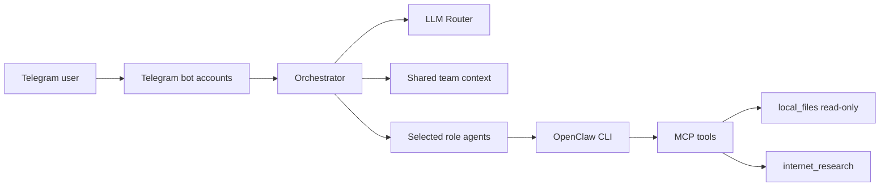
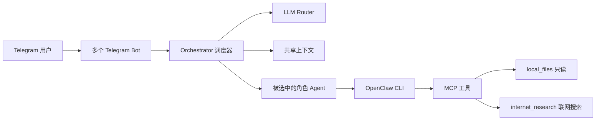

# OpenClaw Telegram Team Orchestrator

English | [中文](#中文)

A clean template for running multiple Telegram bots as one coordinated OpenClaw-style agent team.

This project focuses on a practical middle layer:

- one Telegram bot per role
- semantic role routing
- shared team context
- role-to-role handoff
- OpenClaw execution for MCP/tool-enabled tasks
- read-only local file MCP
- lightweight web research MCP
- explicit approval rules before file writes, shell commands, installs, or config changes

No private personas, API keys, Telegram tokens, logs, memories, or runtime state are included.

Current template version: `v0.2.0`.

## Language Support

The primary router uses LLM-based semantic routing, so it can handle both English and Chinese when the configured model supports them. Keyword matching is only a fallback path for provider failures or very simple direct mentions, and the fallback vocabulary includes both English and Chinese role/task terms.

## Who Should Use This?

| Scenario | Fit | Why |
| --- | --- | --- |
| Personal development assistant | Best fit | Lead, Architect, Engineer, and QA can split planning, implementation, review, and verification. |
| Project coordination group | Best fit | PM handles requirements, Lead coordinates, Engineer implements, and QA checks acceptance. |
| Technical review room | Good fit | Architect reviews design, Engineer checks feasibility, and QA turns the result into testable criteria. |
| Local-file-aware assistant | Good fit | Agents can read allowed local files through read-only MCP and ask before making changes. |
| Casual entertainment chatbot | Not ideal | The orchestrator, role routing, and MCP safety layer are heavier than a simple chat bot needs. |
| Single-bot FAQ or support bot | Not ideal | If one assistant is enough, a multi-role Telegram team adds unnecessary complexity. |

## Why This Exists

Telegram groups are a natural interface for multi-agent teams, but most bot setups either reply independently or require every message to be handled by one monolithic assistant.

This template adds a small orchestrator between Telegram and OpenClaw:

1. receive a group message
2. deduplicate bot events
3. decide which roles should respond
4. pass shared context to selected roles
5. use OpenClaw only when MCP/tools are needed
6. send replies from the corresponding role bots

## Architecture



More details:

- [Architecture](docs/architecture.md)
- [Examples](docs/examples.md)
- [Security](SECURITY.md)

## Default Roles

The publishable template uses generic roles:

- Lead
- Product Manager
- Architect
- Engineer
- QA

You can customize private names, aliases, and personas locally in:

- `config/team.json`
- `personas/*.md`

Do not publish those private files.

## Quick Start

Install dependencies:

```powershell
# Install Node dependencies
npm install
```

Copy example files:

```powershell
# Create local config files from publishable templates
Copy-Item .env.example .env
Copy-Item config\team.example.json config\team.json
New-Item -ItemType Directory -Force personas | Out-Null
Copy-Item personas.example\*.md personas\
```

Fill `.env` with your own values:

- Telegram group id
- Telegram bot tokens
- Telegram bot usernames
- model provider API keys
- OpenClaw WSL distro/bin path

Configure OpenClaw agents matching the ids in `config/team.json`:

- `lead`
- `pm`
- `architect`
- `engineer`
- `qa`

Use `config/openclaw.mcp.example.json` as a reference for MCP setup.

Start:

```powershell
# Disable OpenClaw built-in Telegram polling and start this orchestrator
.\scripts\start_orchestrator.ps1
```

Stop:

```powershell
# Stop only this template's orchestrator process
.\scripts\stop_orchestrator.ps1
```

## Routing Examples

| User message | Expected route | Notes |
| --- | --- | --- |
| `Product Manager, what do you think?` | `PM` | Single-role product judgment. No full PRD unless requested. |
| `Architect and Engineer, discuss the implementation plan first.` | `Architect -> Engineer` | Design review first, implementation feasibility second. |
| `Write requirements first, hand them to Engineering, then let QA verify.` | `PM -> Engineer -> QA` | Natural handoff from requirements to implementation to acceptance. |
| `Everyone, take a quick look at this direction.` | `Lead -> PM -> Architect -> Engineer -> QA` | All-hands review, each role should stay brief and scoped. |

## Tool Safety

The included `local_files` MCP server is read-only. It exposes:

- `list_dir`
- `read_file`
- `search_files`

It does not expose write, delete, move, rename, shell, install, or config-edit tools.

Sensitive paths are blocked by default, including:

- `.env`
- `.git`
- `.ssh`
- cookies/history/login data
- `chrome_user_data`
- `node_modules`
- `venv`
- `.key`, `.pem`, `.pfx`, `.sqlite`, `.db`

## Checks

Run before publishing:

```powershell
# Check JavaScript syntax
npm run check

# Check Python MCP syntax
python -m py_compile mcp_servers\local_files_mcp.py mcp_servers\web_search_mcp.py

# Scan for accidental API keys, Telegram tokens, and private keys
.\scripts\secret_scan.ps1
```

Expected secret scan result:

```text
Secret scan passed: 0 potential secrets found.
```

## Do Not Commit

- `.env`
- `.env.*` except `.env.example`
- `.git/` when uploading manually through the GitHub web UI
- `config/team.json`
- private `personas/*.md`
- `state.json`
- `orchestrator.log`
- live `team_context/*.md`
- `node_modules/`
- `__pycache__/`
- `package-lock.json` if you choose to keep this template lockfile-free
- browser profiles, cookies, or login data
- API keys or Telegram tokens
- Windows reserved-name leftovers such as `nul`

## Known Limits

- Telegram Bot API does not make bots omniscient; the orchestrator still centralizes message handling.
- Search quality depends on public search engine availability.
- OpenClaw agents must be configured separately.
- This is a v0.2.0 template, not a full production framework.

## License

MIT

---

# 中文

一个干净的 OpenClaw + Telegram 多机器人团队模板。

这个项目的目标不是做一个庞大的 Agent 框架，而是提供一个实用的中间层：

- 一个角色一个 Telegram Bot
- Orchestrator 统一调度
- 语义路由判断谁该回复
- 共享上下文
- 角色之间自然交接
- 需要 MCP/工具时调用 OpenClaw
- 本地文件 MCP 默认只读
- 联网搜索 MCP
- 写文件、执行命令、安装依赖、改配置之前必须先得到明确授权

本仓库不包含私人角色、人设、API key、Telegram token、日志、记忆或运行状态。

当前模板版本：`v0.2.0`。

## 语言支持

主路由使用 LLM 语义判断，所以只要你配置的模型支持中英双语，英文和中文都可以使用。关键词匹配只是 Router 失败或极简单点名时的兜底逻辑，并且兜底词表已经覆盖中英双语角色和任务关键词。

## 谁适合用？

| 场景 | 适合程度 | 原因 |
| --- | --- | --- |
| 个人开发助手 | 非常适合 | Lead、架构师、工程师、QA 可以分别处理规划、实现、评审和验证。 |
| 项目管理群 | 非常适合 | PM 负责需求，Lead 负责协调，工程师负责落地，QA 负责验收。 |
| 技术评审室 | 适合 | 架构师评审方案，工程师判断落地成本，QA 转成可验证标准。 |
| 需要读取本地文件的助手 | 适合 | Agent 可以通过只读 MCP 查看允许范围内的本地文件，修改前必须请示。 |
| 纯娱乐/聊天机器人 | 不太适合 | 调度器、角色路由和 MCP 安全层对普通聊天来说偏重。 |
| 单 Bot 就够用的 FAQ/客服 | 不太适合 | 如果一个助手就能解决，多角色 Telegram 团队会增加不必要复杂度。 |

## 为什么做这个

Telegram 群很适合做“AI 团队”的入口，但普通多 Bot 很容易各说各话，或者变成一个大助手假装多人。

这个模板加了一层 Orchestrator：

1. 接收群消息
2. 去重，避免多个 Bot 抢答
3. 判断应该由哪些角色回复
4. 把共享上下文传给被选中的角色
5. 需要 MCP/工具时再走 OpenClaw
6. 用对应角色的 Telegram Bot 发回群里

## 架构



更多文档：

- [架构说明](docs/architecture.md)
- [使用示例](docs/examples.md)
- [安全说明](SECURITY.md)

## 默认角色

开源模板只保留通用角色：

- 负责人 Lead
- 产品经理 Product Manager
- 架构师 Architect
- 工程师 Engineer
- 测试验收 QA

你可以在本地自定义名字、别名和人设：

- `config/team.json`
- `personas/*.md`

这些本地私有文件不要上传 GitHub。

## 快速开始

安装依赖：

```powershell
# 安装 Node 依赖
npm install
```

复制示例配置：

```powershell
# 从可发布模板创建本地私有配置
Copy-Item .env.example .env
Copy-Item config\team.example.json config\team.json
New-Item -ItemType Directory -Force personas | Out-Null
Copy-Item personas.example\*.md personas\
```

填写 `.env`：

- Telegram 群 ID
- Telegram Bot token
- Telegram Bot 用户名
- 模型供应商 API key
- OpenClaw WSL distro/bin 路径

在 OpenClaw 里配置和 `config/team.json` 匹配的 Agent：

- `lead`
- `pm`
- `architect`
- `engineer`
- `qa`

MCP 配置可参考：

```text
config/openclaw.mcp.example.json
```

启动：

```powershell
# 关闭 OpenClaw 内置 Telegram polling，并启动本调度器
.\scripts\start_orchestrator.ps1
```

停止：

```powershell
# 只停止这个模板自己的 Orchestrator 进程
.\scripts\stop_orchestrator.ps1
```

## 路由示例

| 用户输入 | 预期路由 | 说明 |
| --- | --- | --- |
| `产品经理，你怎么看？` | `PM` | 单角色产品判断；没有明确要求时不写完整 PRD。 |
| `架构师和工程师先讨论一下实现方案。` | `Architect -> Engineer` | 先做技术评审，再判断工程落地成本。 |
| `先写需求，再交给工程师实现，最后让 QA 验收。` | `PM -> Engineer -> QA` | 从需求到实现再到验收的自然交接。 |
| `大家都出来看一下这个方向。` | `Lead -> PM -> Architect -> Engineer -> QA` | 全员评审，每个角色都应该简短且守住职责边界。 |

## 工具安全

内置的 `local_files` MCP 默认只读，只提供：

- `list_dir`
- `read_file`
- `search_files`

它不提供写入、删除、移动、重命名、执行 shell、安装依赖或修改配置的工具。

默认屏蔽敏感路径：

- `.env`
- `.git`
- `.ssh`
- cookies/history/login data
- `chrome_user_data`
- `node_modules`
- `venv`
- `.key`, `.pem`, `.pfx`, `.sqlite`, `.db`

## 发布前检查

```powershell
# 检查 JavaScript 语法
npm run check

# 检查 Python MCP 语法
python -m py_compile mcp_servers\local_files_mcp.py mcp_servers\web_search_mcp.py

# 扫描误提交的 API key、Telegram token 和私钥
.\scripts\secret_scan.ps1
```

密钥扫描应该输出：

```text
Secret scan passed: 0 potential secrets found.
```

## 不要提交这些文件

- `.env`
- `.env.*`，但 `.env.example` 除外
- 网页手动上传时不要传 `.git/`
- `config/team.json`
- 私有 `personas/*.md`
- `state.json`
- `orchestrator.log`
- 运行中的 `team_context/*.md`
- `node_modules/`
- `__pycache__/`
- 如果你希望模板不带锁文件，就不要提交 `package-lock.json`
- 浏览器用户数据、cookies 或 login data
- API key 或 Telegram token
- Windows 保留名残留文件，例如 `nul`

## 已知限制

- Telegram Bot API 不会让每个 Bot 自动拥有完整群聊全知视角，仍然需要 Orchestrator 统一调度。
- 搜索质量依赖公开搜索引擎可用性。
- OpenClaw Agent 需要单独配置。
- 这是 v0.2.0 模板，不是完整生产级框架。

## License

MIT