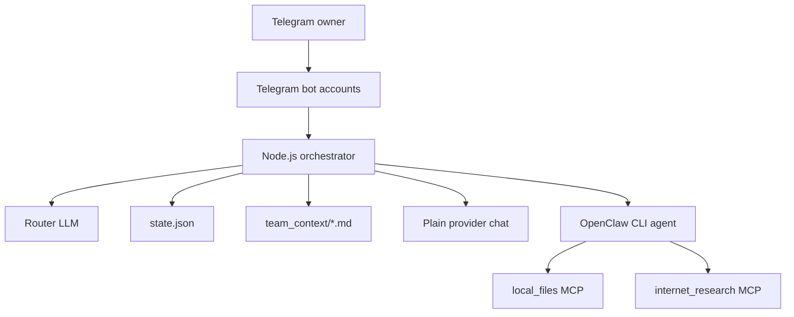

# Architecture

This repository uses a small orchestration layer around Telegram bots and OpenClaw agents.

## Components

## Flow

1. Every Telegram bot receives messages.
2. The orchestrator deduplicates the message so only one coordinator handles it.
3. Explicit mentions and aliases are extracted.
4. A router model decides which roles should answer and in what order.
5. The orchestrator builds a role-specific prompt with recent shared context.
6. Simple chat can go directly to the configured model provider.
7. Tool-heavy tasks go through OpenClaw so MCP tools are available.
8. Replies are sent from the selected role bot accounts.
9. A short context board and handoff notes are saved for the next turn.

## Design Choices

- Telegram delivery is centralized to avoid duplicated replies.
- Agent roles are configurable data, not hard-coded private personas.
- Shared context is short and append-only to avoid uncontrolled token growth.
- MCP file access is read-only by default.
- The router is semantic-first; fallback rules are only a reliability backup.

## Runtime Files

Generated files are intentionally ignored by Git:

- `state.json`
- `orchestrator.log`
- live `team_context/*.md`
- `.env`
- private `personas/*.md`
- private `config/team.json`

## Extension Points

- Add roles in `config/team.json`.
- Add private persona files in `personas/*.md`.
- Add new MCP servers through OpenClaw config.
- Adjust routing by editing the router system prompt in `src/openclaw_orchestrator.js`.
